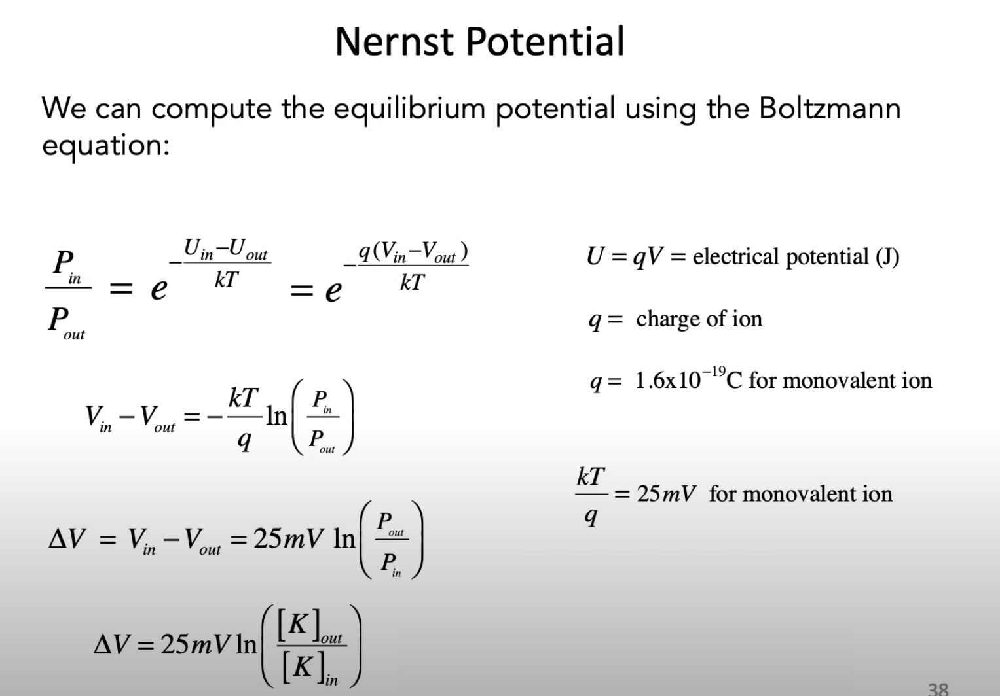

# Introduction to Neural Computation
## Prof. Michale Fee
## Daniel Zysman

# Overview and Ionic Currents
- Neuroscience now is about understanding and developing Engineering Level descriptions of Brain Sytems and "Circuits".
- There have been tremendous improvements in the technology to image and track changes in the brain.
- What we're after is how to relate this information to the "Circuit Models" which are being developed.
- Here is an example probe:

- How do you relate this high dimensional datasets and use them?
- You use Mathematical Techniques to analyze meural data in a way that allows us to relate it to mathematical models.
- Song birds learn by imitating their parents songs.
- The course goals are:
  1. Understand the basic biophysics of neurons and networks and other pricniples underlying brain and cognitive functions.
  2. Use mathematical techniques to:
    * Analyze simple models of neurons and networks.
    * Do data analysis of behavioral and neuronal data.
  3. Become proficient at using numerical methods to implement these techniques.

- We're going to start with a model of Neuron:

- We do this since it's important that the current, voltage, resistance is well defined for the model of the brain.

- Neurons also have complex morphologies.
- If combine a capacitor with a resistor then it looks like a filter.
- For a circuit, you need wires and we therefore our *Circuit Model of the Brain* needs them too.
- This is the intra and extra cellular solution which is our wires.
- This area is filled with a salt solution.
- The first thing we need to discuss will be **Thermal Energy**.

- Counter intuitively, **Diffusion** is fast at short length scales and slow at long length scales.

- It takes a very long time for the distribution of particles to flatten out.
- There are more combinations where a particle can do some lefts, then some rights and end up back where it started.

- What is the average displacement?:

- What this means is that the center of the distribution has not changed.
- Calculating the the average distance is simply the variance in Statistical terms:

- This just means that the variance grows as a constant rate.
- **Diffusion Coefficient**:

- **The Distance that a particle diffuses - on average, from it's starting point - grows with the square root of time.**
- Now we'll look at **Fisk's First Law**:
  1. Diffusion produces a net flow of particles from regions of high concentration to regions of lower concentration.
  2. The flux of particles is proportional to the concentration gradient.
- If you divide by the distance then it looks like a derivative:

- Current flow in neuron's obeys Ohm's Law.

- Resistivity in the brain is really lousy.
- Due to this, the brain has to create this gimmick - an **Action Potential** to actually send anything.

# RC Circuit and Nernst Potential
- Today we're going to start working on the **Resistor-Capacitor** model.
- Many, if not most, ion channels are sensitive to voltage.
- Nearly every aspect of computation and signaling in a neuron is controlled by voltage.
- Neurons can do numerical integration over time:

- A **Capacitor** is two wires separated by an insulator.

- As positive charges build on the inside of the membrane, they repel positive charges on the outside of the membrane.

- An electric field over some distance corresponds to a voltage difference.
- The **Capacitance of Current** is just the rate at which charge imbalance is changing.

- We can integrate to get the the total change in voltage:

- Cell membranes allow the current to flow around it.
- What happens when you poke a hole in the cell membrane and it starts to leak?
- The effect can simply be modeled as a resistor.
- The leaked current and the passing current has to be equal to the passing current.

- After we Steady-State the Differential Equation, we just get Ohm's Law back out with different symbols.

- The derivative always approaches zero in this case at an exponential rate:

- It is easier to think about resistance in terms of **Conductance**.

- The total *Capacitance* is just the sum of the *Capacitance*.
- The capacitance of a cell depends linearly on its surface area.
- You can write the membrane time constant as capacitance per unit Area over conductance per unit area:

- Without a battery, the "circuit" just returns to 0 once we turn the voltage off.
- The cell "connects this battery" at different times to different "wires" for different action potentials.
- Where do the batteries of a neuron come from?:
  1. Ion concentration gradients.
  2. Ion-selective permeability of ion channels.

- This is complicated so we're going to use the **Boltzman Equation** instead:

# Nernst Potential and Integrate and Fire Models
- This potential is different depending on the kind of ion in the saline solution.
- Calcium is kept to a very low level intentionally since once is shows up it will do something important.
- For Potassium conductance, if you hold the voltage above the equilibrium then potassium ions move out of the cell.
- Our basic model for describing the Current-Voltage relationship:

- The **Driving Potential** is the V-Ek in the final formula.

- **Action Potentials** are really important but most of the time the neuron is not spiking.
- Most of the time, it is simply accepting input so we're now going to look at another model called **Integrate and Fire**.
- No extra information is carried in the spike waveform.
- When a neuron reaches **Spike Threshold**, then  it fires:

- When we insert voltage, it will constantly cause a neuron to spike.
- Now we'll calculate the **Firing Rate** of our neuron model:

- This was all assuming there was no leaking.
- Now we'll add it back - with leakage:

- Now, we'll update our old formula with the new one:

# Hodgkin-Huxley Model Part 1

# Hodgkin-Huxley Model Part 2

# Dendrites

# Synapses

# Spike Trains

# Receptive Fields

# Time Series

# Spectral Analysis Part 1

# Spectral Analysis Part 2

# Spectral Analysis Part 3

# Rate Models and Perceptrons

# Matrix Operations

# Basis Sets

# Principal Components Analysis​

# Recurrent Networks

#  Neural Integrators

# Hopfield Networks

# Research:
- Alex Hodgin?
- Andrew Huxley?
- Louis Lapique, 1907?

# Reference:
