# Practical Deep Learning for Coders 2020
## Jeremy Howard
## Sylvain Gugger
## Rachel Thomas

1. [Lesson 1: Everyone Can Do World Class](#lession1)
2. [Lesson 2: Getting Our Feet Wet With Ideas and Training](#lession2)
3. [Lesson 3: Loading, Modifying and A Fork in Movement](#lession3)
4. [Lesson 4](#lession4)
5. [Lesson 5](#lession5)
6. [Lesson 6](#lession6)
7. [Lesson 7](#lession7)
8. [Lesson 8](#lession8)


# <a name="lession1">Lesson 1</a>
- This class is intended to be a definitive version for the Course.
- There is a book for the course now.
- The the course follows the book closely; you can also download it for free if you wanted.
- **Don't be an asshole and convert the Notebooks to books.**


- **Deep Learning** comes out of *Neural Networks* which was the work of Warren McCulloch and Walter Pitts in 1943.
- Their work was built onto by **Frank Rosenblatt** who claimed "we are about to witness the birth of such a machine - a machine capable of perceiving, recognizing and identifying its surroundings without any human training or control".
- An MIT professor Marvin Minsky published a book called *Perceptrons* which showed that a single neuron was unable to learn basic mathematical ideas.
- Much happened and in 1986 MIT released a series of books called *Parallel  Distributed Processing*.
- While Jeremy was using them around 1980, some researchers 30 years ago had pointed out that to get good performance you would need more layers.
- To learn, we're going to use:
  1. Play the whole game.
  2. Make the game worth playing.
  3. Work on the hard parts.
- The software stack is:
  1. Fastai on top.
  2. PoyTorch in the middle.
  3. Python at the bottom.
- We will be using **PyTorch** instead of **Tensorflow** since it is faster.
- "PyTorch doesn't have higher level APIs, so we built Fastai."
- You will need a GPU machine to run the examples - well.
- Please use one of the platforms provided instead of your machine since it will be easier.
- **If you're using something that is not free than please shut it down.**
- The forums are very important because that is where all the discussion will take place.
- **I will not be annotating anything about Jupyter Notebooks since I'm accustom to using them.**

- First block:
```python
# CLICK ME
from fastai.vision.all import *
path = untar_data(URLs.PETS)/'images'

def is_cat(x): return x[0].isupper()
dls = ImageDataLoaders.from_name_func(
    path, get_image_files(path), valid_pct=0.2, seed=42,
    label_func=is_cat, item_tfms=Resize(224))

learn = cnn_learner(dls, resnet34, metrics=error_rate)
learn.fine_tune(1)
```
- Don't worry about understanding the code yet.
- We created a widgets function which can allow us to update files:
```python

uploader = widgets.FileUpload()
uploader

# Get the image:
img = PILImage.create(uploader.data[0])

# Make a prediction:
img = PILImage.create(uploader.data[0])
is_cat,_,probs = learn.predict(img)
print(f"Is this a cat?: {is_cat}.")
print(f"Probability it's a cat: {probs[1].item():.6f}")
```
- Machine learning is like regular programming: a way to get computers to complete a specific task.
- The normal model of coding:

- **Arthur Samuel** started working on different ways to get computers to complete tasks.
- He thought that we should feed examples to a computer and let it solve it itself.

- **Inference** is using a trained model to do a task.
  * This is not the traditional definition of *inference*.
- Neural Networks are flexible enough to do any task per the **Universal Approximation Theorem**.
- But to do that, we will need a way to update the weights - which is done via **Stochastic Gradient Descent**.
- The terminology has changed but the model is the same:

- There are some limitations:
  * A model cannot be created without data.
  * A model can only learn from the patterns it sees in the input Data.
  * The model makes *predictions*, but does not recommend *actions*.
  * It is not enough to have data; you also need labels for the data.
- **Be wary of proxies which represent the values you actually care about**.
- "We spent a lot of time investing in how to allow you to import * without [ combinatorially ] importing everything."
- While we're importing *fastai2*, this version is a pre-release version and *fastai* will be swapped to this latest version.
- There are four defined domains in Fastai:
  1. Vision.
  2. Text.
  3. Tabular.
  4. Collaborative Filtering.
- If you type the function without calling it then it will tell you where it comes from in a Notebook.
- You can call the `doc()` function to get the documentation for a function.
- All of the documentation is fully run-able Jupyter Notebooks.
- When training, you have to tell it:
  1. What data to use?
  2. What architecture to use?
  3. What metrics will be printed out?
- The parameter `valid_pct` will specify how much of the data set should be validation.
- This is to fight **Overfitting**:

- The library is built so that a similar structure of code can be used for multiple domains.


# <a name="lession2">Lesson 2</a>
- We're going to be looking at Training and Validation more.
- Of note, the `label_func` paramter must return a logical value.
- When you are trying to predict a category, we call that a **Classification Model.**
- Any time that you are trying to predict a number, we call that **Regression**.
- **Regression is not Linear Regression; this is a mistake**.
- After you train for a while, the model predictions will get worse and this is due to **Overfitting**.
- We'll be talking about a learner later but it's a container for the data and the architecture.
- **Resnet** is the kind of architecture; 34 is the number of layers.
- An **Epoch** is what it is called when you look at every single image in the data set once.
- The **Loss** is the not exactly the same thing as your metric,
- For the *loss function*, you need something where you can change by a little bit higher or lower and measure the change.
- The **Metric** is the thing that you care about; the **Loss** is what your model cares about to update parameters.
- **Overfitting** is basically when the model is cheating by identifying patterns in an item vs the category.
- However, sometimes over time the model can be learn even the validation set and sometimes it is a good idea to set aside a third subset: the **Test Set**.
- Be wary of time series data and building validation,test sets on random data.
- Next, we need to learn about the next line of code and **Transfer Learning**:
```python
learn.fine_tune(1)
```
- **Transfer Learning** is using a pretrained model for a different task than what it was originally trained for.
- It turns out that if you use an already trained model and train your model by running more epochs that you end up with a far more accurate model than if you would have done it without.
- Visualization turns out to be important to getting great results.
- From the paper by Matt Zeiler and Rob Fergus, found a way to draw a picture of the first layer.
- What they found is that the first layer founds diagonal lines and gradients - which are simple.
- Layer two takes the features of layer one and combines them into more abstract representations.
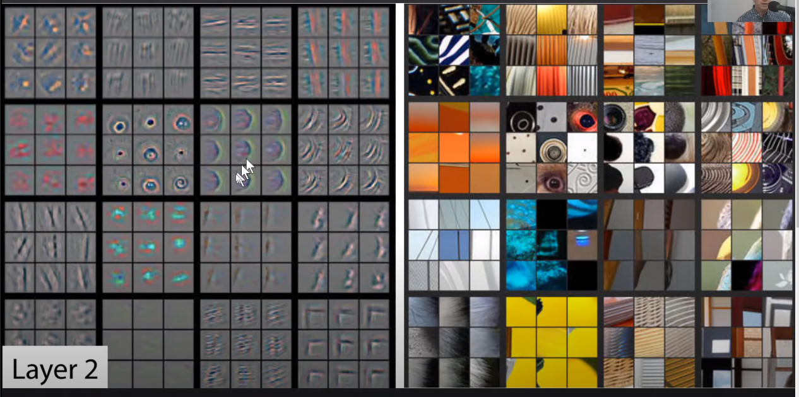
- And, if you keep the earlier layers then you get those identification kernels for free.
- These methods are not just good at recognizing phones but extend beyond that.
- There are all kinds of things which can be transformed into pictures.
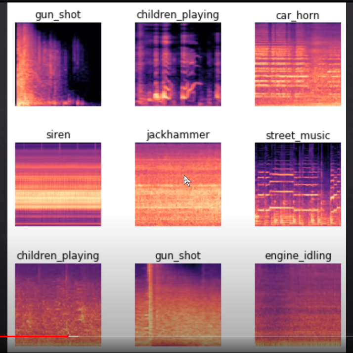
- **Make sure to memorize these terms and their meanings**:
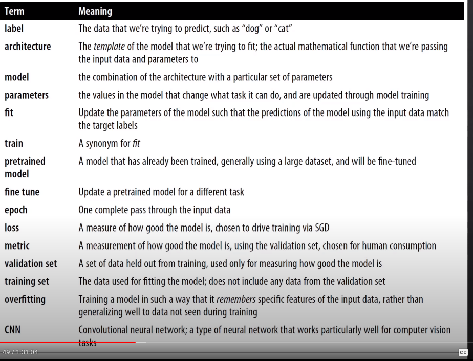
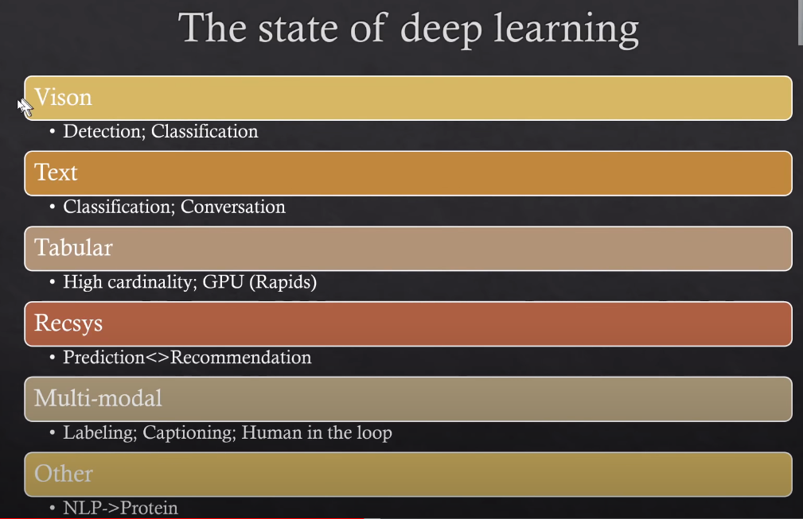
- The difference between a **Recommendation** ( something similar we don't know about ) and **Prediction** (something we're already aware of) matters in many selling contexts.
- When claiming results, we need to be aware of when a result would fall inside of normal values for parameters.
- We use a **P-Value** to measure how likely it is that our data is random or real:
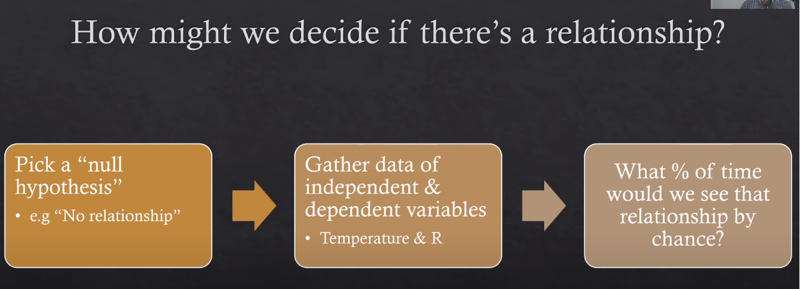
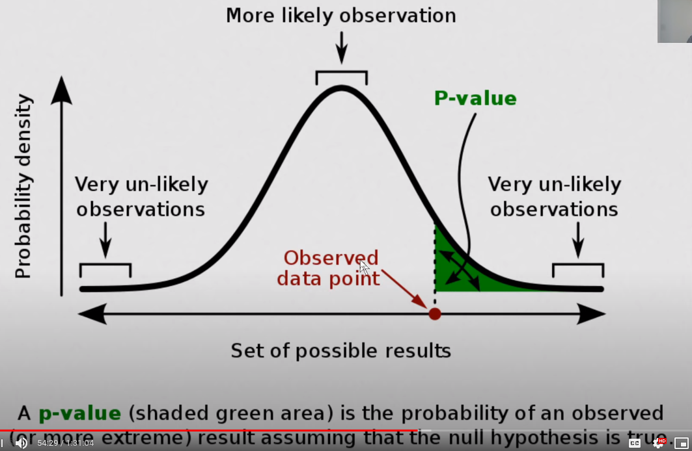
- P Values are terrible:
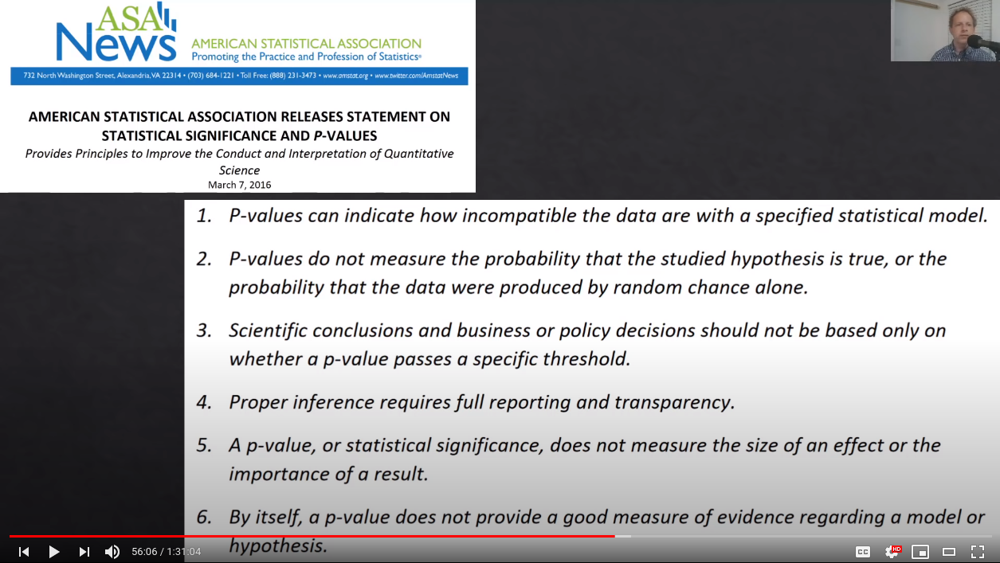
- Jeremy Developed a different want to approach Data Products called the **Drive Train Approach**.
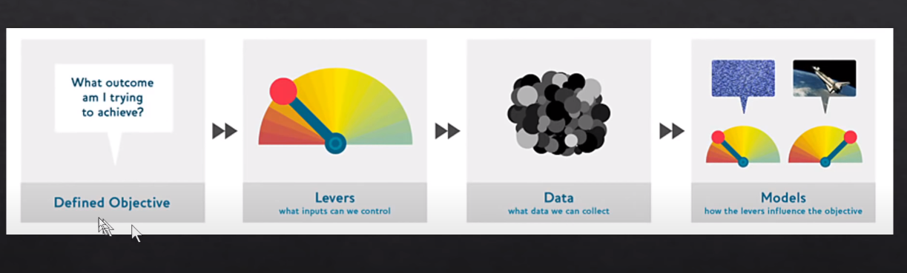
- **Autocorrelates** are variables which are are closely related.
- Think about this from a Utility point of view; what actions can I take?:
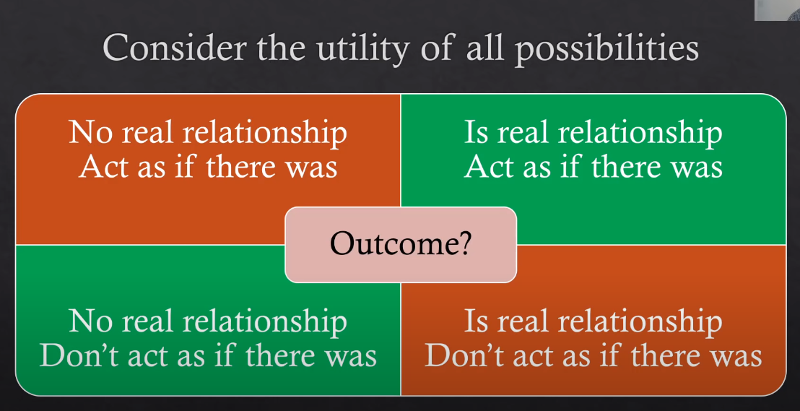
- When building models, we try and think about prior beliefs.
- **I am not signing up for Bing Image Search.**
- Something not mentioned is that it is common for categories to be in their own folders - as seen from the file structure in the image:
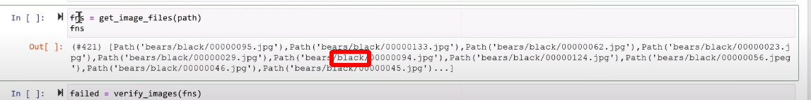
- You can verify is something is an image using the function:
```python
fns = get_image_files(path)
failed = verify_images(fns)
failed
```
- You can delete those items that fail using:
```python
failed.map(Path.unlink);
```
- The first thing we need to do is tell Fastai what kind of data we have and how it is structured.
- We're going to be looking at the DataBlock API for data set creation.
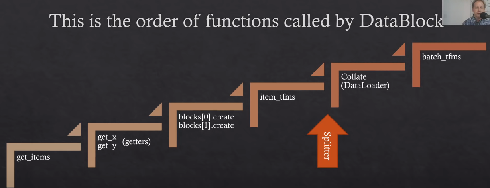
```python

bears = DataBlock(
    blocks=(ImageBlock, CategoryBlock),   # What kind of data and labels is this?
    get_items=get_image_files,            # how do we get the data?
    splitter=RandomSplitter(valid_pct=0.2, seed=42), # how do we split the data?
    get_y=parent_label,                   # use the directory the image sits in to label it.
    item_tfms=Resize(128))                # what transforms will be applied?
```
- This is the most common way that images are stored for model creation.
- This all gets put into a **Data Loader** which is something in PyTorch which gets a set of images at a time.
- You can create a **Confusion Matrix** for the categories after training:
```python
interp = ClassificationInterpretation.from_learner(learn)
interp.plot_confusion_matrix()
```
- You can also see what were the offending images using:
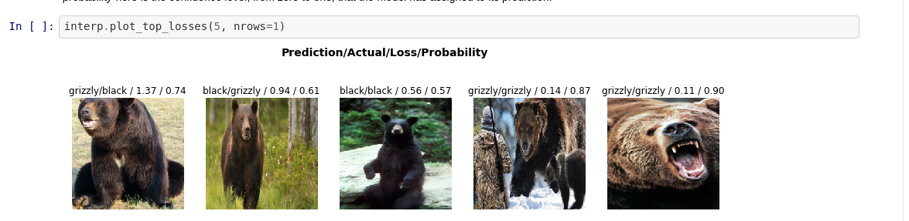
```python
interp.plot_top_losses(5, nrows=1)
```
- It will also print images which it is most confident about.
- Getting a model into production, we will export and import it later:
```python
learn.export()

# Pull it back in later:
learn_inf = load_learner(path/'export.pkl')

# predictions:
learn_inf.predict('images/grizzly.jpg')
```


# <a name="lession3">Lesson 3</a>
- We're back and you should of played with everything by this time.
- We skipped over the transforms part - which we're coming back to now.
- The lines `item_tfms=Resize(128)` means that the images will be resized to 128x128.
- You can see the images using `dls.valid.show_batch(max_n = <n>, nrows=<n>)`:
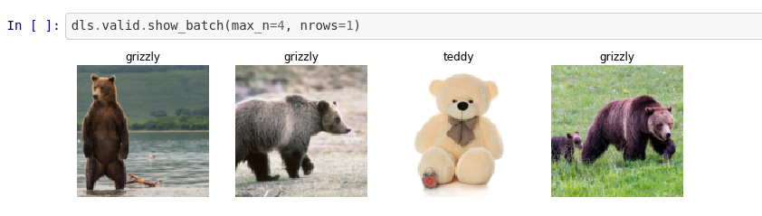
- While you don't have to make the images squares, it is the most common.
- You can change the transforms using `bears.new()`:
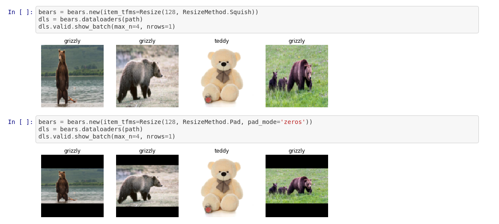
```python
bears = bears.new(item_tfms=Resize(128, ResizeMethod.Squish))
dls = bears.dataloaders(path)
dls.valid.show_batch(max_n=4, nrows=1)

# ---

bears = bears.new(item_tfms=Resize(128, ResizeMethod.Pad, pad_mode='zeros'))
dls = bears.dataloaders(path)
dls.valid.show_batch(max_n=4, nrows=1)
```
- The `ResizeMethod.Squish` tends to be the most efficient.
- The best is to use `RandomResizeCrop` which takes a different part of the image.
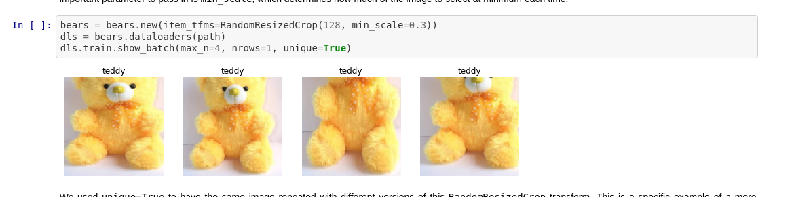
- This method is called **Data Augmentation** of which this is simply one of them.
- The best way to do this is with `aug_transforms` which returns a list of different augmentations.
- This is usually done on a Batch of images - hence **Batch Transforms** which is different than **Item Transforms** per above.
- Fastai will automatically avoid doing transforms on the validation set.
- **It is normally easier to clean your data after the model is created.**
- You can filter manually which images to keep or discard with an `ImageClassifierCleaner`:
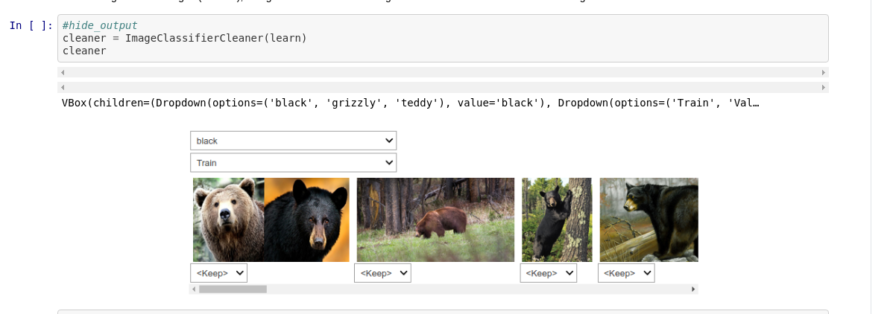
```python
cleaner = ImageClassifierCleaner(learn)
cleaner

# actually kill them:
for idx in cleaner.delete(): cleaner.fns[idx].unlink()
for idx,cat in cleaner.change(): shutil.move(str(cleaner.fns[idx]), path/cat)
```
- The prediction gives you the predicted category along with a tensor of the probability of each class.
- They wont make sense unless you ask for the order of the categories - which you can get with `learn.dls.vocab`.
- So, Jeremy et al have found a way to show off the Application in a Notebook.
- This uses *IPython widgets* which contains lots of GUI type functions.
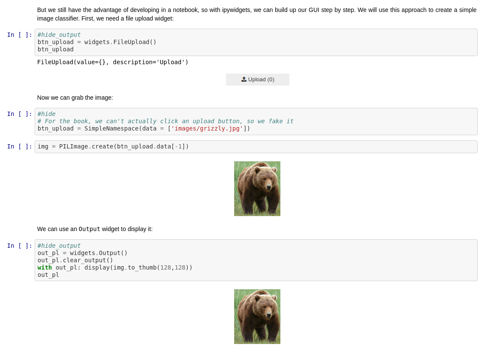
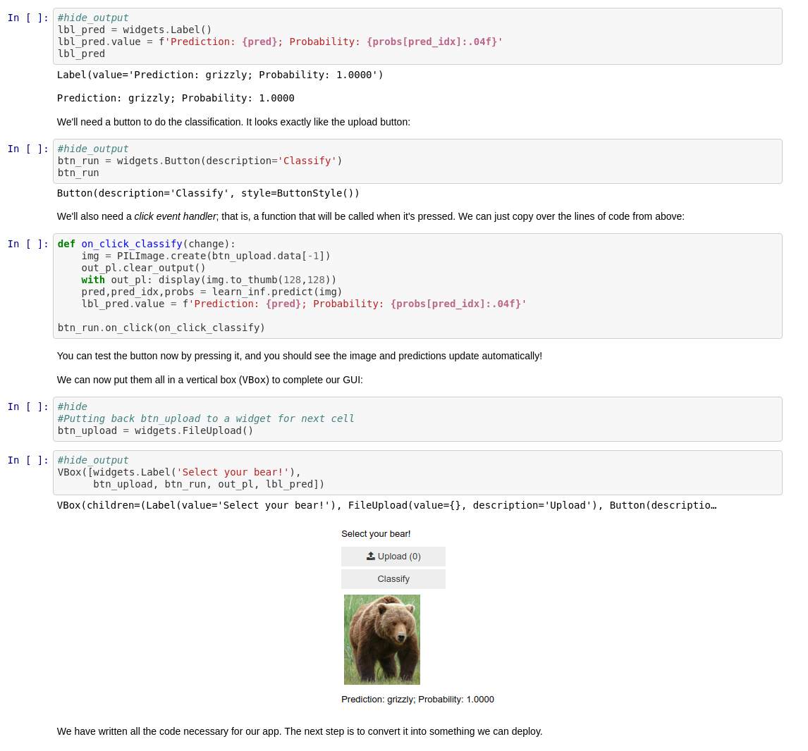
- While this prototyping apps are interesting, we'll want them in a real place people can run.
- We're going to be using `Voila!`.
- You will install it using:
```
!pip install voila
!jupyter serverextension enable voila —sys-prefix
```
- This will only allow allow users to interact with the widgets in a Notebook.
- You just need to change the url to point to voila in the path.
- You can now user mybinder.org to run the notebook for you!
- It was found that most people just need to deploy to a CPU than to a GPU since there is no harm in running the model one at a time.
- You can deploy to a mobile phone but if you do then deploy to a server and have the mobile phone talk to the server.
- **Homework: Create your own Application**.
- Beware that the data you're training on is related to the actual input you're going to be using.
- **Beware of Out of Domain Data**.
- **Beware of Domain Shift**.
- Remember that it is impossible to really know what the model is doing.
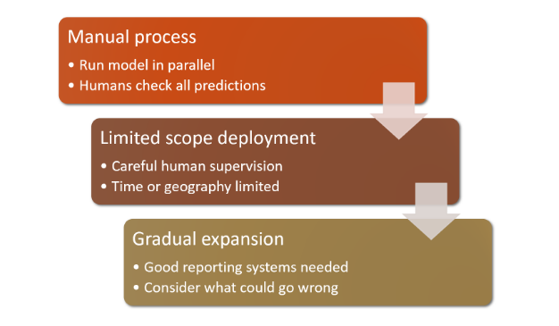
- The best advice would be to start blogging sooner.
- They have made a technology called **Fastpages** which is as blog based on notebooks.
  * Write posts for people one step behind you.
- It is a good idea to start with something simple and scale it up.
- You can set the base path using `Path.BASE_PATH = <path>`.
- The library **Fastcore** is where much of the foundational stuff is located.
- One easy way to deal with images is to convert them to numbers.
- You can convert the image into a matrix using `array()` which is from numpy.
- And, `tensors()` are PyTorch's version on Matrices.
- The biggest - and most meaningful difference - is that you can put them on a GPU.
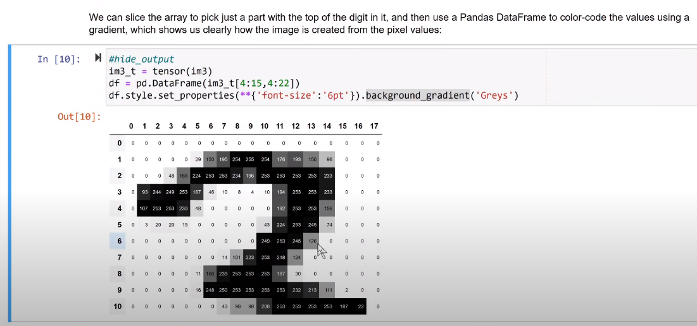
- One mistake that is usually done is that people fail to create a baseline model.
- A **Baseline** model is a simple model which you are confident should perform reasonably well.
- You can use `show_image()` on a tensor to see it from Fastai.
- You can stack dimensions on a tensor using `torch.stack()`.
- You can get the rank of a tensor by taking the length of its shape.
- The **Mean Absolute Difference (L1 Norm)** is the mean of the absolute value of the difference.
- The **Root Mean Squared Error (RSME/L2 Norm)** is the square root of the mean of square of differences.
- We don't have to write this ourselves though since it's already give to us:
```python
F.l1_loss(a_3.float(), mean7), F.mse_loss(a_3,mean7).sqrt()
```
- I know what **Broadcasting** is and how it works.
- One of the advantages of this is to avoid looping.
- So, now we're going to learn about **Gradient Descent**; this is how the model weights get updated.
- The process is:
  1. Initialize the weights.
  2. For each image, use these weights to predict whether it appears to be a 3 or a 7.
  3. Based on these predictions, calculate how good the model is (its loss).
  4. Calculate the gradient, which measures for each weight, how changing that weight would change the loss
  5. Step (that is, change) all the weights based on that calculation.
  6. Go back to the step 2, and repeat the process.
  7. Iterate until you decide to stop the training process (for instance, because the model is good enough or you don't want to wait any longer).
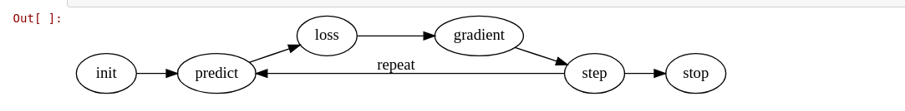
- Fastai has a nice little function called `plot_function` which does exactly that.
- So, the idea is to try to get to the lowest point by modulating the steps taken:
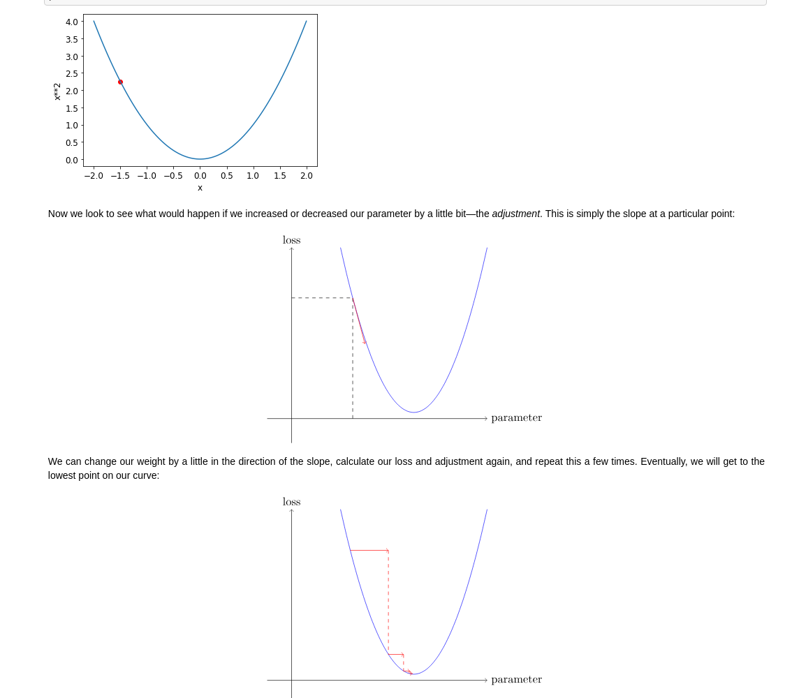
- And so, we now need Calculus to find the derivatives for functions.
- To do this, you will need to attach `.requires_grad()` to a tensor.
- And, any functions now applied to the tensor will be remembered for gradient calculation.
- To calculate them, just call `tensor.backward()`.
- It is certain that at some points the gradient will be zero and if you multiply by that then it will never update.


# <a name="lession4">Lesson 4</a>
- Now we're going further into how to create the model on MNIST.
- The way we reshape torch tensors is with the `.view()` function.
```python
train_x = torch\
  .cat([stacked_threes, stacked_sevens])\
  .view(-1, 28*28) # change the dims; fill the rows with however
                   # many there are in the data.
```
- You will need a matrix and this ...
```python
tensor([1]*len(threes) + [0]*len(sevens))
```
- ... will produce a vector.
- The `.squeeze(1)` will add a unit dimension because that is what pytorch expects to see.
- A **PyTorch Dataset** is something e can index into; this must return a tuple.
- We need there to be weights for each pixel: `init_params((28 * 28,1 ))`.
- Remember that we want to avoid 0's and we add a bias variable.
- The weights and bias together make up the **Parameters**.
- We can now calculate the predictions using a matrix multiply:
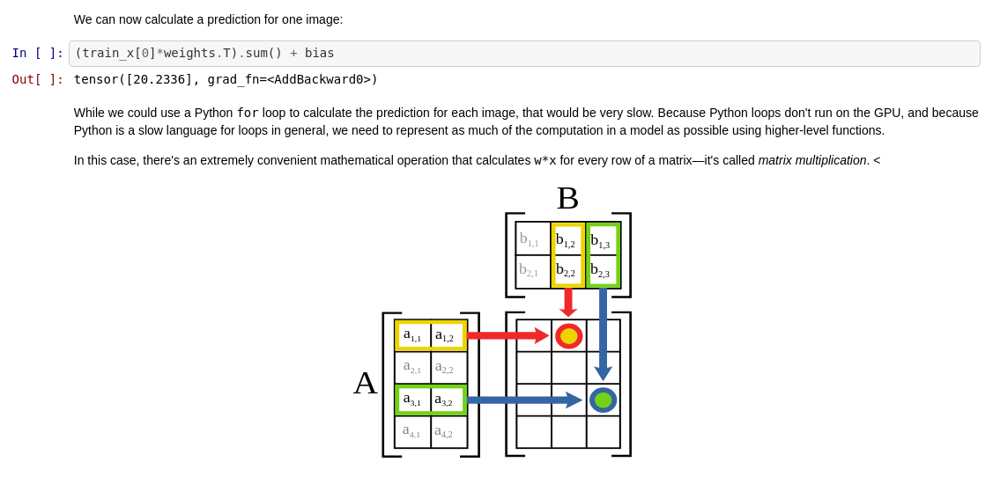
- In python, `@` is the matrix multiplication operator.
- If you want a number instead of a single value tensor, then you need to add `.item()`.
- You cannot use **Accuracy** as a loss function because it causes 0s in gradients due to being a "bumpy function" with weight updates.
- So, what we need is a function which will take our  large numbers and convert them all into numbers between 0 and 1.
- This function is the **Sigmoid Function**:
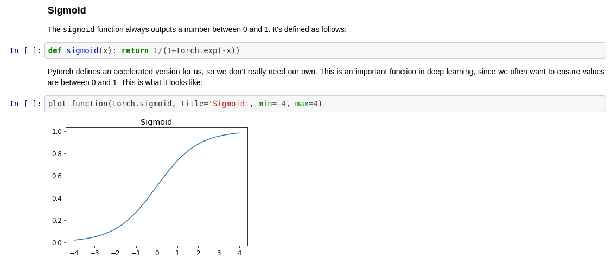
- While we could do a prediction, step combo with each individual image, what we'll actually do is look at batches of lots of images.
- The term for this is called a **Mini-batch**.
- The size of the *mini-batch* is called the **Batch Size**.
- We get these mini-batches by asking for them from a **Data Loader** from PyTorch.
```python
dl = DataLoader(ds, batch_size=6, shuffle=True)
```
- Putting it all together so far:
```python
for x,y in dl:
    pred = model(x)                    # get predictions.
    loss = loss_func(pred, y)          # calc loss
    loss.backward()                    # compute grads
    parameters -= parameters.grad * lr # modify weights.
```
- If you run it twice you will notice that the gradients changed.
- This is because `.backward()` doesn't only calculate them but calculates and adds them to the existing gradients.
- To remove them after, call `tensor.grad.zero_()`.
- Remember that if you write to `.data` for a tensor that you're telling PyTorch explicitly *do not update the gradients*.
- And, now we can run the set of *epochs* and we'll get better predictions:
```python
for i in range(20):
    train_epoch(linear1, lr, params)
    print(validate_epoch(linear1), end=' ')
```
- We're going to replace our custom linear function with the inbuilt on called `nn.Linear(28*28,1)`.
- You can see the parameters in it by calling `model.parameters()`.
- And, now we're going to create an optimizer.
- We don't have to create it though since PyTorch and Fastai both come with SGD.
- Fastai has the loop function built in called `Learner.fit()`.
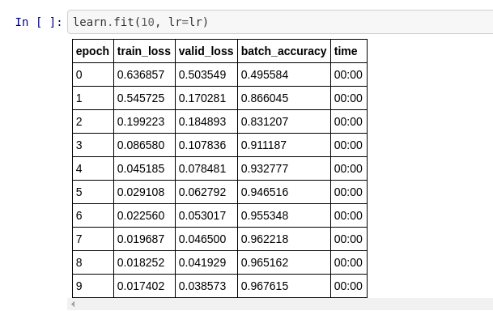
- Before that, we'll want to create a Learner:
```python
learn = Learner(dls, nn.Linear(28*28,1), opt_func=SGD,
                loss_func=mnist_loss, metrics=batch_accuracy)
```
- This is where the API is to really build experiments.
- But, now we want non-linearity so we can get a Neural Network.
- And, here is how it's done:
```python

def simple_net(xb):
    res = xb@w1 + b1
    res = res.max(tensor(0.0))  # This is the non-linear "magic"
    res = res@w2 + b2
    return res
```
- All this does is return the value itself or 0: whichever is bigger.
- This is called a **Rectified Linear Unit (ReLu)** which is a fancy term for a simple idea.
- The reason this non-linear function exists is that if it didn't then we could re-write both linear functions into a single one.
- This, of course, is also already in PyTorch as well: `F.relu()`.
- All this really is just **Function Composition** which is really just functions applied to functions applied to functions.
- Which PyTorch gives to us in `nn.Sequential()`:
```python
simple_net = nn.Sequential(
    nn.Linear(28*28,30),
    nn.ReLU(),
    nn.Linear(30,1)
)
```
- So, we can now train with this instead.
- We can look inside of our models using `learn.recorder.values`:
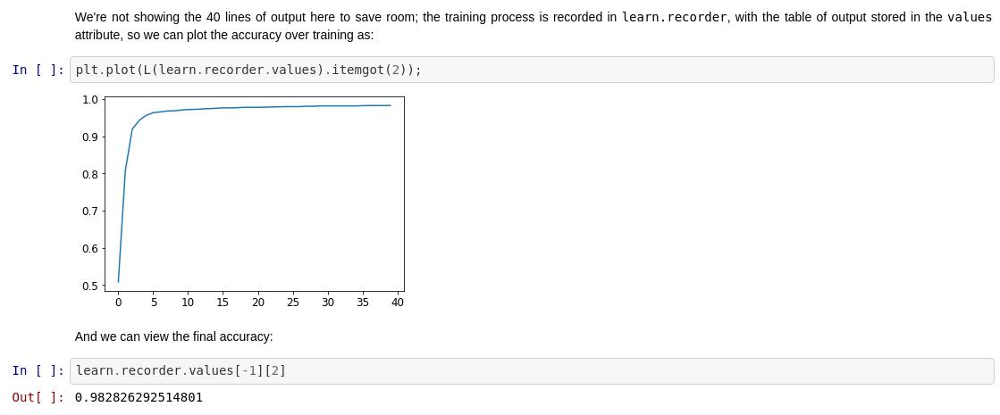
- You can get the actual model itself using `learn.model`.
- You can actually plot the weights internally:
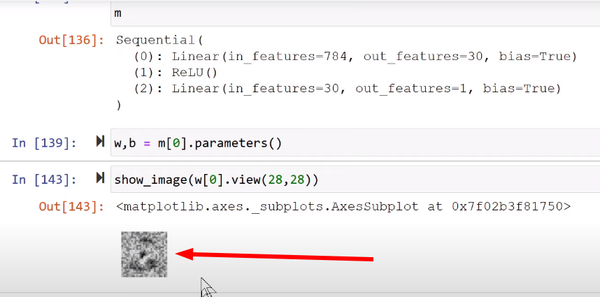
- Lets rewind and look at how to make a data set useful.
- Quick clarification that the function `L()` returns what is essentially an enhanced python list.
- Now we're going to do a quick usage of **Regular Expressions** which you should know how to do.
```python
re.findall(
  r'(.+)_\d+.jpg$', #grab value in the parenthesis.
  fname.name
)
```
- Now that this allows us to get the category, we can build a data block:
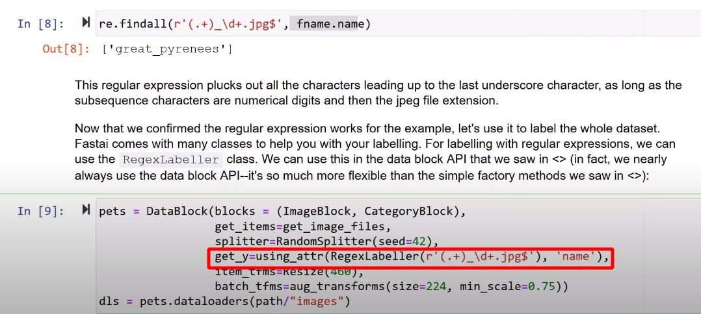
- Fastai has what it calls **Presizing** which is a kind of Data Augmentation which is designed to minimize data destruction while mainlining good performance.

- Because the first step is creating a square, the warping second one can happen on the GPU - which is much faster.
- Fastai keeps track of the shift in a lossless manor which improves the quality:
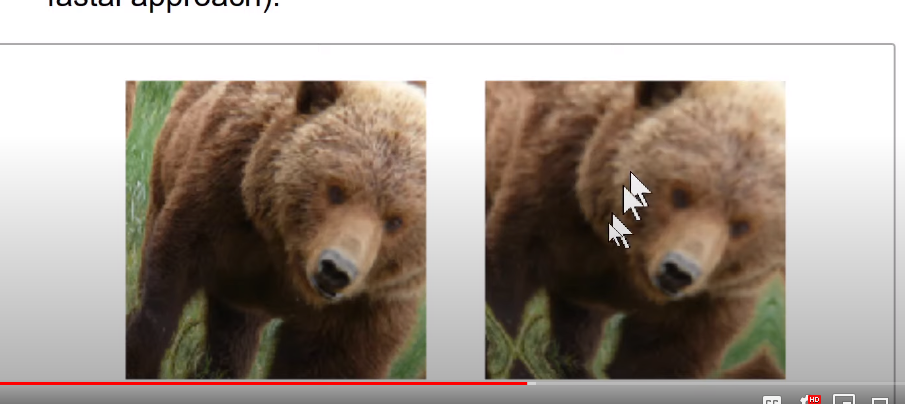
- You can force to see all augmentations on the same image using `unique=True` in the `show_batch()` call.
- You can get a summary of the processes ran using `dls.summary()`.
- People say to do a bunch of data cleaning first but that's advised against; model as soon as you can.
- You will see in `cnn_learner()` that a loss function is not passed.
- This is because Fastai will try sane defaults as much as it can.
- You can check what it picked via `learn.loss_func`.
- In this case it selected **Cross Entrpopy Loss** which is the next topic.
- This like the mnist_loss we wrote before but works with more than two categories.
- A desirable attribute to the predictions is that all the values add up to one and one value dominates.
- This is where **Softmax** will be what we need.
- This function is similar to the Sigmoid function that we used but includes the ability to handle more than one category.
```python
def softmax(x): return exp(x) / exp(x).sum(dim=1, keepdim=True)
```
- What happens is that if one of the probabilities is slightly bigger, then it will be much bigger after softmax.
- "For each of these, return the rows and columns":
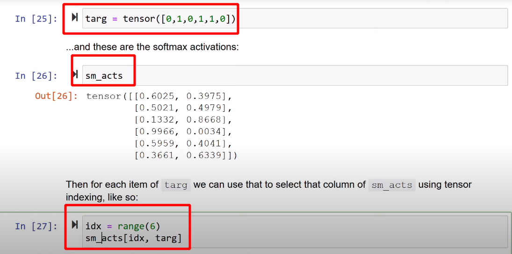
- This already exists in PyTorch called `F.nll_loss`.
- While the function doesn't care about the difference between .99 and .999, we do since that is 10 magnitudes better performance.
- So if you take softmax and feed that into negative loss likelyhood then you get **Cross Entropy**.
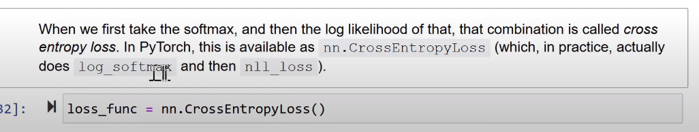


# <a name="lession5">Lesson 5</a>
- Lots of articles pointing out that Technology is a tool.
- **Feedback Loops** is when your model is controlling the next round of data you get.
- When building models, you're not just observing reality; you're interacting with it.
- It is really important to build systems where it is easy to identify and address mistakes.
- Data collection has played a role in Genocides.
- **Ethics** is the dscipline of dealing with what is good and bad.
- It is not the same as religion, law, social norms, etc.
- It is not a fixed set of rules.
- Literally nobody knows what they're doing and everyone in Academia cares about much larger than their domain of knowledge.
- The largest agreed upon topic is Critique.
- The first Set of Values is **Recourse** and **Accountability**.
- "It is always been a challenge for bureaucracy to assign responsibility; it is used to evade responsibility."
- Always keep in mind that database records have errors.
- Improved Access Controls are lacking in many systems.
- People respond an adapt to metrics - which can lead to socially negative behavior.
- Any metric is just a proxy for what you care about.
- Our online environments are designed to be addictive.
- The fundamental online business model is centered on manipulating people's behavior & monopolizing their time.
- **Blitzscaling** is prioritizing speed over efficiency.
- There are three common philosophies:
  1. **Utilitatian**: The good to be maximized.
  2. **Deontological**: Adhering to the right.
  3. **Virtue Ethics**: Lives by a Code of Honor.

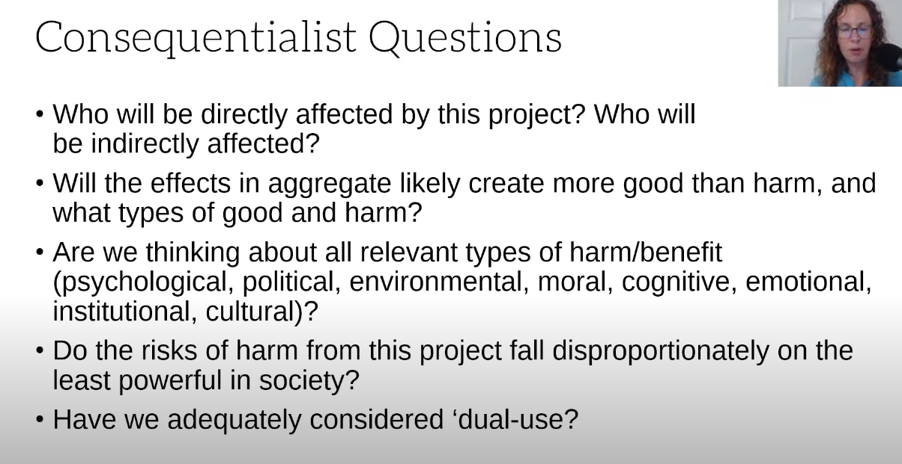
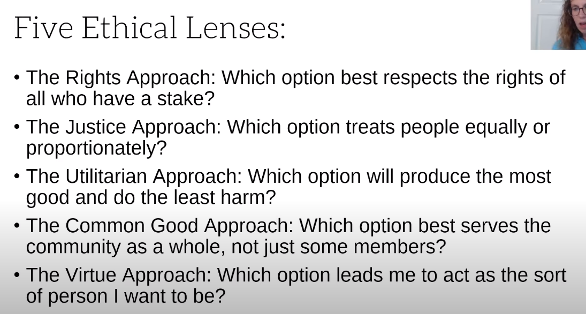
- Me: Credentialism is garbo.


# <a name="lession6">Lesson 6</a>
- There is no little point in having a model if you don't know what it is doing.
- Most often, a **Confusion Matrix** would be used:
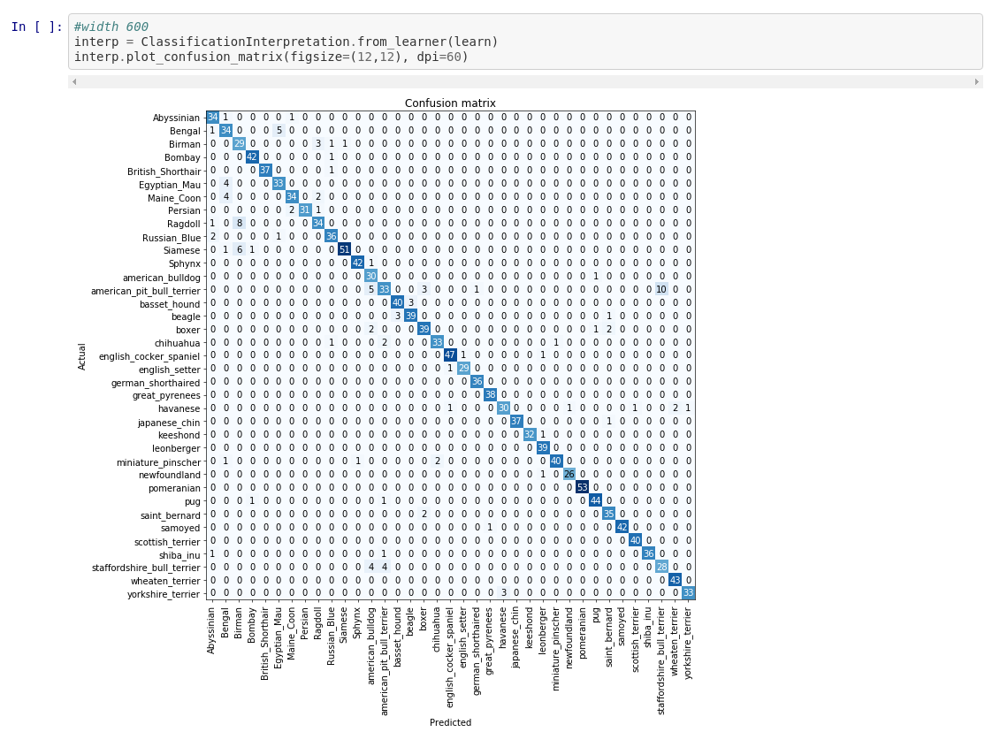
- With so many, it would be better to check the most confused instead:
```python
interp.most_confused(min_val=5)
```
- One way to improve to the model is to improve the **Learning Rate**.
- This will allow you to train faster.
```python
learn.fine_tune(1, base_lr=0.1)
```
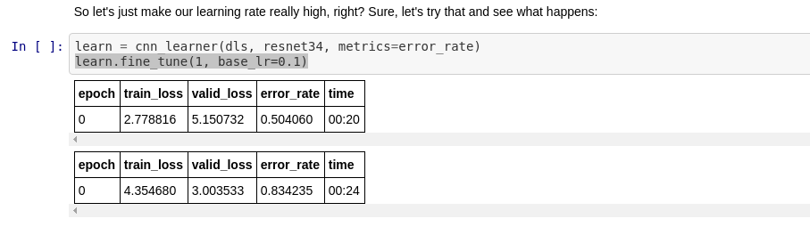
- **Leslie Smith** Came up with the **Learning Rate Finder** which plots the loss against the learing rate.
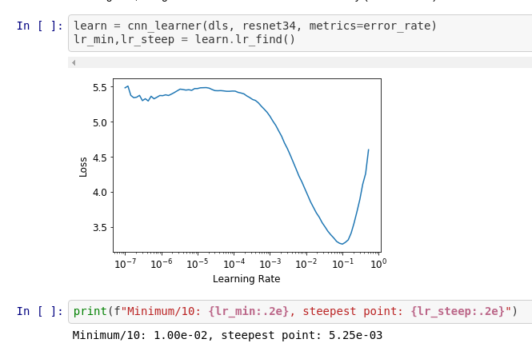
```python
learn = cnn_learner(dls, resnet34, metrics=error_rate)
lr_min,lr_steep = learn.lr_find()
```
- For transfer learning:
  1. Throw away the last layer since it's from a different data.
  2. Attach a new layer which is randomly initialized.
  3. Train that new layer.
- The call `self.freeze()` makes it so that only the last layers weights will get "stepped".
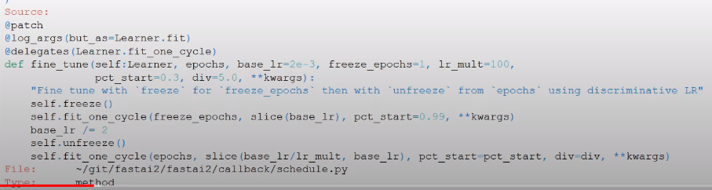
- **Discriminative Learning Rates** is where the learning rate is variable across the layers, where the smallest is closet to the base and the largest is closer to the last layer.
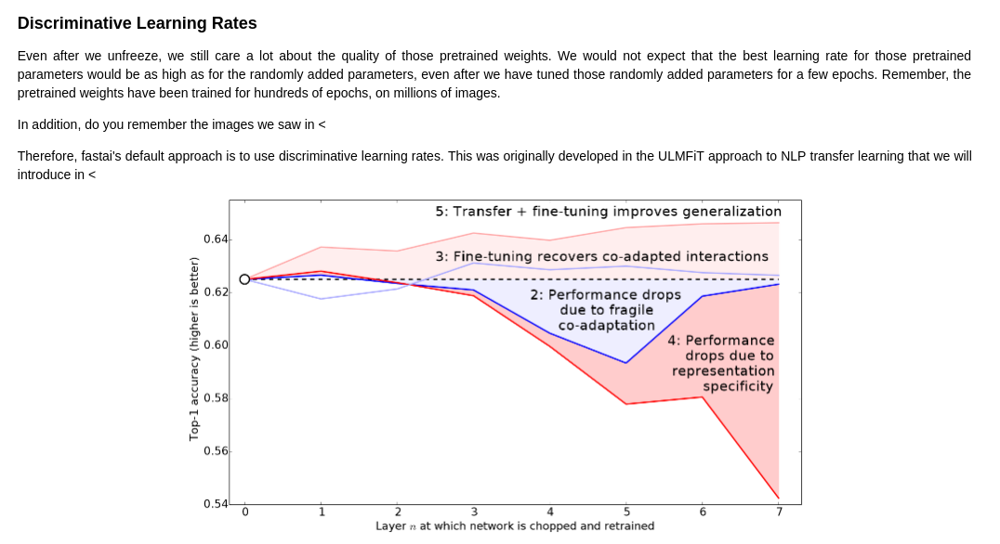
```python
learn = cnn_learner(dls, resnet34, metrics=error_rate)
learn.fit_one_cycle(3, 3e-3)
learn.unfreeze()
learn.fit_one_cycle(12, lr_max=slice(1e-6,1e-4))
```
- **Fit One Cycle** has an adaptive method where it starts with a lower learning rate then specified, after about a third of batches it reaches the highest specified learning rate and then for the rest slowly decreases.
- You can ask for the learner to use **Floating Point 16** using `.to_fp16()` on the learner.
- This will usually cause a speed up in training on compatible GPUs.
- Now we're going to look at Multi-Label Detection.
- Fastai has a Factory function for creating test and validation datasets:
```python
# will run f1,f2 separately on the same input.
dss = Datasets(a, [[f1],[f2]])
```
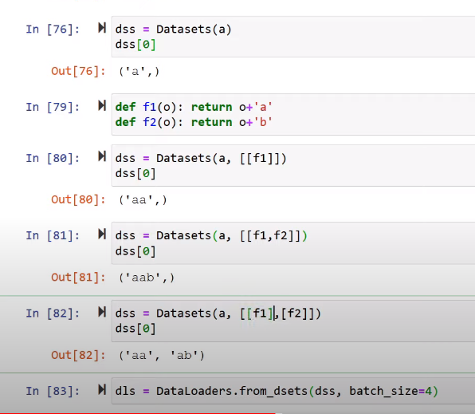
- By default, the DataBlock will just randomly split the rows.
- This isn't much use unless we pass functions to them:
```python

dblock = DataBlock(get_x = lambda r: r['fname'], get_y = lambda r: r['labels'])
dsets = dblock.datasets(df)
dsets.train[0]
```
- Beware that Python really doesn't like saving anything with lambdas in it.
- Now that we understand the API, we can now tell it what they are and how to handle them:
```python
dblock = DataBlock(blocks=(ImageBlock, MultiCategoryBlock),
                   get_x = get_x, get_y = get_y)
```
The array of zeros and ones which comes out of the *MultiCategoryBlock* is a **One-Hot Encoding** of the the categories.
- This means that you get 0s for when it is not there and 1 when there is it.
- You can also add a splitter argument to the DataBlock API in case there is a column which tells you which is the test/validatoin.
```python
def splitter(df):
    train = df.index[~df['is_valid']].tolist()
    valid = df.index[df['is_valid']].tolist()
    return train,valid

dblock = DataBlock(blocks=(ImageBlock, MultiCategoryBlock),
                   splitter=splitter,
                   get_x=get_x,
                   get_y=get_y)
```
- `F.binary_cross_entropy` is the same as `nn.BCELoss`.
- Those above don't include the sigmoid so to do that you will want to use `F.binary_cross_entropy_with_logits` and `nn.NLLLoss`
- Python has a function called `partial()` which can modify the keyword argument defaults but builds off the old function.
- This allows you to modify them in place such as the threshold in accuray:
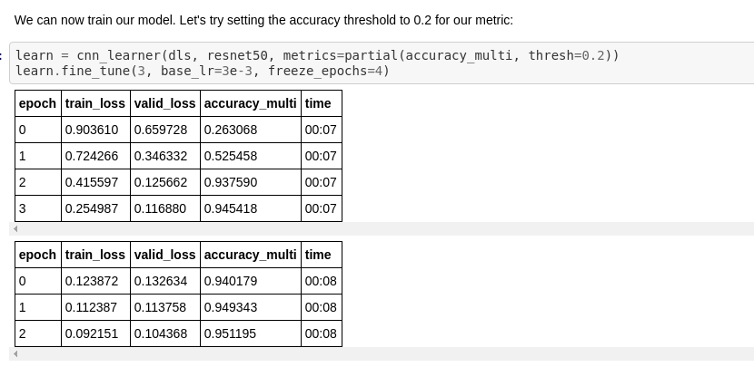
- Now we're going to go beyond just the normal image classification.
> To be able to move beyond fixed applications, to crafting your own novel solutions to novel problems, it helps to really understand the data block API (and maybe also the mid-tier API, which we'll see later in the book). As an example, let's consider the problem of image regression. This refers to learning from a dataset where the independent variable is an image, and the dependent variable is one or more floats. Often we see people treat image regression as a whole separate application—but as you'll see here, we can treat it as just another CNN on top of the data block API.

- The parameter `y_range` tells fastai what to expect for the values of Y.
- This works by generating a sigmoid underneath:
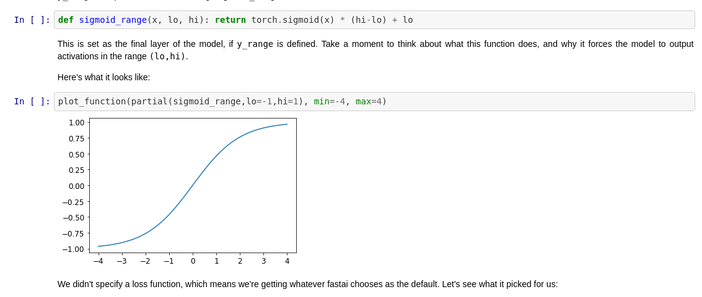
- You can have more or less than 3 channels for images.

- Now we're moving on to **Collaborative Filtering**.
- The foundational idea here is that there are **Latent Factors** about movies which gets people to pick them.
- **Cross Validation** is not common with Deep Learning - unless you're in a competition like on Kaggle.
- The **Dot Produt** is taking a sum of the element-wise multiplication of matrices or vectors.
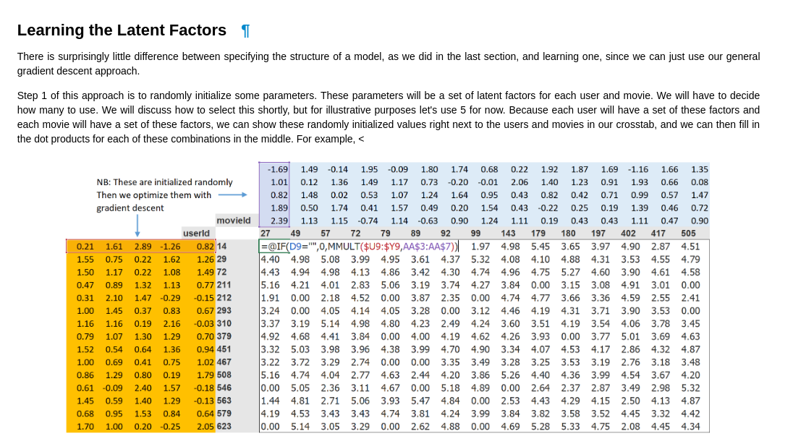
- Finding the set of random variables that best fit is what collaborative filtering is.
- You can create a DataLoaders object from a dataframe:
```python
dls = CollabDataLoaders.from_df(<data>, item_name='<y-variables', bs=<bs>)
```
- We no longer have only a vocab since we have both titles and users - which you can see with `dls.classes`.
- You will find the user and the movie indexes and do a dot product on them.
- This is a problem since *find from index* is not a linear model.
- However, there is an equivalent form which is a representation as a matrix product using *One-Hot Encoded Vector*.
- This will include only the values with ones in them - which are the one-hot encoded values - and then you multiply:
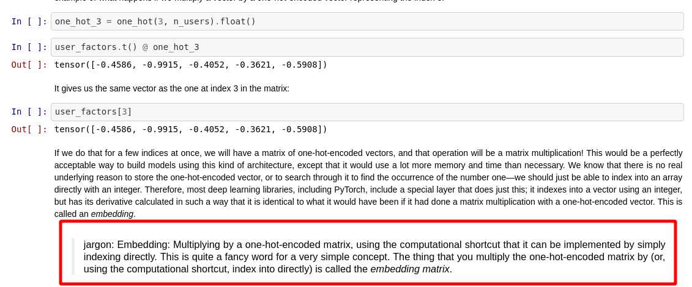
- **I know about Python Inheritance**.
- The actual computation is placed in a method called `forward()`.
```python

class DotProduct(Module):
    def __init__(self, n_users, n_movies, n_factors, y_range=(0,5.5)):
        self.user_factors = Embedding(n_users, n_factors)
        self.movie_factors = Embedding(n_movies, n_factors)
        self.y_range = y_range

    def forward(self, x):
        users = self.user_factors(x[:,0])
        movies = self.movie_factors(x[:,1])
        return sigmoid_range((users * movies).sum(dim=1), *self.y_range)
```
- Another thing which might show up is that there might just be a general bias on a movie or the user.
- So, we'll want to add a bias Embedding:
```python

class DotProductBias(Module):
    def __init__(self, n_users, n_movies, n_factors, y_range=(0,5.5)):
        self.user_factors = Embedding(n_users, n_factors)
        self.user_bias = Embedding(n_users, 1)
        self.movie_factors = Embedding(n_movies, n_factors)
        self.movie_bias = Embedding(n_movies, 1)
        self.y_range = y_range

    def forward(self, x):
        users = self.user_factors(x[:,0])
        movies = self.movie_factors(x[:,1])
        res = (users * movies).sum(dim=1, keepdim=True)
        res += self.user_bias(x[:,0]) + self.movie_bias(x[:,1])
        return sigmoid_range(res, *self.y_range)
```
- While it isn't obvious, we'll want to use some form of **Regularization** to improve the results.
- What these do is penalize a model for overfitting.


# <a name="lession7">Lesson 7</a>

# <a name="lession8">Lesson 8</a>

# Research:
- Mark I Perceptron?
- *Perceptrons* by Marvin Minsky?
- Professor David Perkins?
- what is `gv()`?
- Domain specific pretrained models?
- Who is Frank Harrell?
- ImageClassifierCleaner?
- Vue.js in widgets framework?
- mybinder.org ?
- ONNX Runtime?
- Lenet 5?


# Come back:
- [torch.stack](https://youtu.be/5L3Ao5KuCC4?t=4917)
- [Review .view() since I cannot visualize it](https://youtu.be/p50s63nPq9I?t=306)
- [Review torch.where()](https://youtu.be/p50s63nPq9I?t=1213)
- [Updates notes with Negative Log likelihood](https://youtu.be/p50s63nPq9I?t=6574)
- [Multi-Label Datasets](https://youtu.be/cX30jxMNBUw?t=1905)
- [Manually Build CSV from Training](https://youtu.be/cX30jxMNBUw?t=2717)


# Reference
- [Fastai Online Book](https://github.com/fastai/fastbook)
- [Paper: **Fastai: A Layered API for Deep Learning**](papers/Layered-API-for-Deep-Learning.pdf)
- [Paper: **Artificial Intelligence: A Frontier in Automation**](papers/Artificial-Intelligence-A-Frontier-of-Autmation.pdf)
- [Paper: **Multilayer Feedforward Networks are Universal Approximators**](papers/Multilayer-Feedforward-Networks-are-Universal-Approximators.pdf)
- [Paper: **Visualizing and Understanding Convolutional Networks.pdf**](papers/Visualizing-and-Understanding-Convolutional-Networks.pdf)
- [Model Zoo](https://modelzoo.co/)
- [Splunk: Catching a Fraudster Use case](images/https://www.splunk.com/en_us/blog/security/deep-learning-with-splunk-and-tensorflow-for-security-catching-the-fraudster-in-neural-networks-with-behavioral-biometrics.html)
- [Audio Classification With CNNs](images/https://medium.com/@etown/great-results-on-audio-classification-with-fastai-library-ccaf906c5f52)
- [Paper: **Malware Classification With Deep Convolutional Neural Network**](papers/Malware-Classification-with-Deep-Convolutional-Neural-Network.pdf)
- [Original Drive Train Article](https://www.oreilly.com/radar/drivetrain-approach-data-products/)
- [Paper: **Actionable Auditing Investigating Impact of Publicly Naming Biased Performance Results of Commercial AI Prodcuts**](papers/Actionable-Auditing-Investigating-Impact-of-Publicly-Naming-Biased-Performance-Results-of-Commercial-AI-Prodcuts.pdf)
- [Fastpages for Blogging](https://github.com/fastai/fastpages)
- [Paper: Whats Measured is What Matters Targets and Gaming in the English Public Healthcare System](papers/Whats-Measured-is-What-Matters-Targets-and-Gaming-in-the-English-Public-Healthcare-System.pdf)
- [Markkula Center For Applied Ethics](https://www.scu.edu/ethics/)
-
