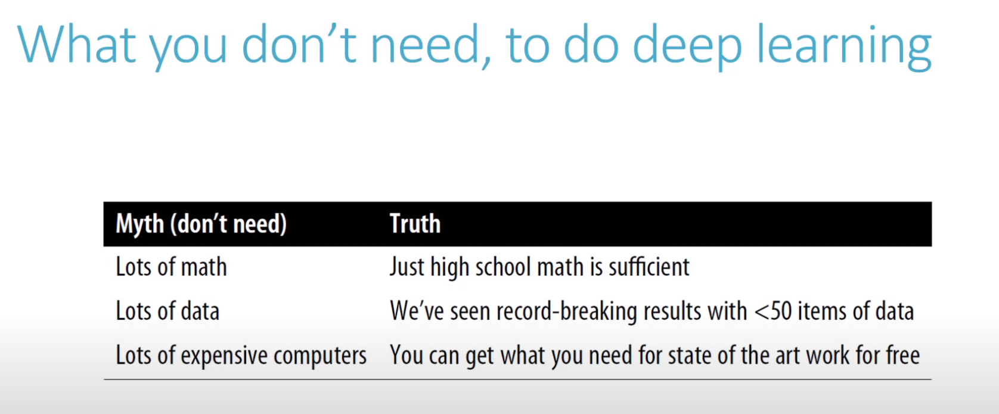

# Practical Deep Learning for Coders 2020
## Jeremy Howard
## Sylvain Gugger
## Rachel Thomas

1. [Lesson 1](#lession1)
2. [Lesson 2](#lession2)
3. [Lesson 3](#lession3)
4. [Lesson 4](#lession4)
5. [Lesson 5](#lession5)
6. [Lesson 6](#lession6)
7. [Lesson 7](#lession7)
8. [Lesson 8](#lession8)

# <a name="lession1">Lesson 1</a>
- This class is intended to be a definitive version for the Course.
- There is a book for the course now.
- The the course follows the book closely; you can also download it for free if you wanted.
- **Don't be an asshole and convert the Notebooks to books.**

- **Deep Learning** comes out of *Neural Networks* which was the work of Warren McCulloch and Walter Pitts in 1943.
- Their work was built onto by **Frank Rosenblatt** who claimed "we are about to witness the birth of such a machine - a machine capable of perceiving, recognizing and identifying its surroundings without any human training or control".
- An MIT professor Marvin Minsky published a book called *Perceptrons* which showed that a single neuron was unable to learn basic mathematical ideas.
- Much happened and in 1986 MIT released a series of books called *Parallel  Distributed Processing*.
- While Jeremy was using them around 1980, some researchers 30 years ago had pointed out that to get good performance you would need more layers.
- To learn, we're going to use:
  1. Play the whole game.
  2. Make the game worth playing.
  3. Work on the hard parts.
- The software stack is:
  1. Fastai on top.
  2. PoyTorch in the middle.
  3. Python at the bottom.
- We will be using **PyTorch** instead of **Tensorflow** since it is faster.
- "PyTorch doesn't have higher level APIs, so we built Fastai."
- You will need a GPU machine to run the examples - well.
- Please use one of the platforms provided instead of your machine since it will be easier.
- **If you're using something that is not free than please shut it down.**
- The forums are very important because that is where all the discussion will take place.

# <a name="lession2">Lesson 2</a>

# <a name="lession3">Lesson 3</a>

# <a name="lession4">Lesson 4</a>

# <a name="lession5">Lesson 5</a>

# <a name="lession6">Lesson 6</a>

# <a name="lession7">Lesson 7</a>

# <a name="lession8">Lesson 8</a>

# Research:
- Mark I Perceptron?
- *Perceptrons* by Marvin Minsky?
- Professor David Perkins?
- [Paper: **Fastai: A Layered API for Deep Learning**](papers/Layered-API-for-Deep-Learning.pdf)

# Reference
- [Fastai Online Book](https://github.com/fastai/fastbook)
