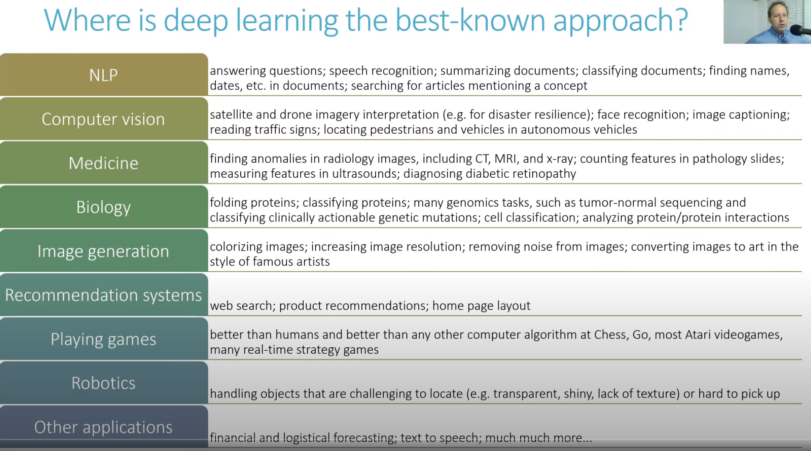

# Practical Deep Learning for Coders 2020
## Jeremy Howard
## Sylvain Gugger
## Rachel Thomas

1. [Lesson 1](#lession1)
2. [Lesson 2](#lession2)
3. [Lesson 3](#lession3)
4. [Lesson 4](#lession4)
5. [Lesson 5](#lession5)
6. [Lesson 6](#lession6)
7. [Lesson 7](#lession7)
8. [Lesson 8](#lession8)


# <a name="lession1">Lesson 1</a>
- This class is intended to be a definitive version for the Course.
- There is a book for the course now.
- The the course follows the book closely; you can also download it for free if you wanted.
- **Don't be an asshole and convert the Notebooks to books.**


- **Deep Learning** comes out of *Neural Networks* which was the work of Warren McCulloch and Walter Pitts in 1943.
- Their work was built onto by **Frank Rosenblatt** who claimed "we are about to witness the birth of such a machine - a machine capable of perceiving, recognizing and identifying its surroundings without any human training or control".
- An MIT professor Marvin Minsky published a book called *Perceptrons* which showed that a single neuron was unable to learn basic mathematical ideas.
- Much happened and in 1986 MIT released a series of books called *Parallel  Distributed Processing*.
- While Jeremy was using them around 1980, some researchers 30 years ago had pointed out that to get good performance you would need more layers.
- To learn, we're going to use:
  1. Play the whole game.
  2. Make the game worth playing.
  3. Work on the hard parts.
- The software stack is:
  1. Fastai on top.
  2. PoyTorch in the middle.
  3. Python at the bottom.
- We will be using **PyTorch** instead of **Tensorflow** since it is faster.
- "PyTorch doesn't have higher level APIs, so we built Fastai."
- You will need a GPU machine to run the examples - well.
- Please use one of the platforms provided instead of your machine since it will be easier.
- **If you're using something that is not free than please shut it down.**
- The forums are very important because that is where all the discussion will take place.
- **I will not be annotating anything about Jupyter Notebooks since I'm accustom to using them.**

- First block:
```python
# CLICK ME
from fastai.vision.all import *
path = untar_data(URLs.PETS)/'images'

def is_cat(x): return x[0].isupper()
dls = ImageDataLoaders.from_name_func(
    path, get_image_files(path), valid_pct=0.2, seed=42,
    label_func=is_cat, item_tfms=Resize(224))

learn = cnn_learner(dls, resnet34, metrics=error_rate)
learn.fine_tune(1)
```
- Don't worry about understanding the code yet.
- We created a widgets function which can allow us to update files:
```python

uploader = widgets.FileUpload()
uploader

# Get the image:
img = PILImage.create(uploader.data[0])

# Make a prediction:
img = PILImage.create(uploader.data[0])
is_cat,_,probs = learn.predict(img)
print(f"Is this a cat?: {is_cat}.")
print(f"Probability it's a cat: {probs[1].item():.6f}")
```
- Machine learning is like regular programming: a way to get computers to complete a specific task.
- The normal model of coding:

- **Arthur Samuel** started working on different ways to get computers to complete tasks.
- He thought that we should feed examples to a computer and let it solve it itself.

- **Inference** is using a trained model to do a task.
  * This is not the traditional definition of *inference*.
- Neural Networks are flexible enough to do any task per the **Universal Approximation Theorem**.
- But to do that, we will need a way to update the weights - which is done via **Stochastic Gradient Descent**.
- The terminology has changed but the model is the same:

- There are some limitations:
  * A model cannot be created without data.
  * A model can only learn from the patterns it sees in the input Data.
  * The model makes *predictions*, but does not recommend *actions*.
  * It is not enough to have data; you also need labels for the data.
- **Be wary of proxies which represent the values you actually care about**.
- "We spent a lot of time investing in how to allow you to import * without [ combinatorially ] importing everything."
- While we're importing *fastai2*, this version is a pre-release version and *fastai* will be swapped to this latest version.
- There are four defined domains in Fastai:
  1. Vision.
  2. Text.
  3. Tabular.
  4. Collaborative Filtering.
- If you type the function without calling it then it will tell you where it comes from in a Notebook.
- You can call the `doc()` function to get the documentation for a function.
- All of the documentation is fully run-able Jupyter Notebooks.
- When training, you have to tell it:
  1. What data to use?
  2. What architecture to use?
  3. What metrics will be printed out?
- The parameter `valid_pct` will specify how much of the data set should be validation.
- This is to fight **Overfitting**:

- The library is built so that a similar structure of code can be used for multiple domains.


# <a name="lession2">Lesson 2</a>

# <a name="lession3">Lesson 3</a>

# <a name="lession4">Lesson 4</a>

# <a name="lession5">Lesson 5</a>

# <a name="lession6">Lesson 6</a>

# <a name="lession7">Lesson 7</a>

# <a name="lession8">Lesson 8</a>

# Research:
- Mark I Perceptron?
- *Perceptrons* by Marvin Minsky?
- Professor David Perkins?
- what is `gv()`?

# Reference
- [Fastai Online Book](https://github.com/fastai/fastbook)
- [Paper: **Fastai: A Layered API for Deep Learning**](papers/Layered-API-for-Deep-Learning.pdf)
- [Paper: **Artificial Intelligence: A Frontier in Automation**](papers/Artificial-Intelligence-A-Frontier-of-Autmation.pdf)
- [Paper: **Multilayer Feedforward Networks are Universal Approximators**](papers/Multilayer-Feedforward-Networks-are-Universal-Approximators.pdf)
-
